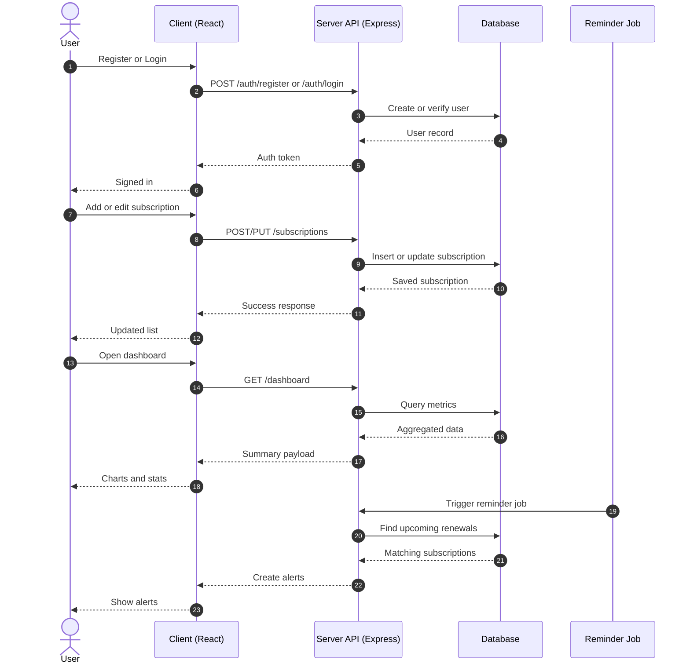

# Smart Subscription Manager - Sequence Diagram

```mermaid
sequenceDiagram
    autonumber
    actor User
    participant Client as Client (React)
    participant API as Server API (Express)
    participant DB as Database
    participant Scheduler as Reminder Job

    %% Auth flow
    User->>Client: Register or Login
    Client->>API: POST /auth/register or /auth/login
    API->>DB: Create or verify user
    DB-->>API: User record
    API-->>Client: Auth token
    Client-->>User: Signed in

    %% Subscriptions CRUD flow
    User->>Client: Add or edit subscription
    Client->>API: POST/PUT /subscriptions
    API->>DB: Insert or update subscription
    DB-->>API: Saved subscription
    API-->>Client: Success response
    Client-->>User: Updated list

    %% Dashboard summary flow
    User->>Client: Open dashboard
    Client->>API: GET /dashboard
    API->>DB: Query metrics
    DB-->>API: Aggregated data
    API-->>Client: Summary payload
    Client-->>User: Charts and stats

    %% Alerts and reminders flow
    Scheduler->>API: Trigger reminder job
    API->>DB: Find upcoming renewals
    DB-->>API: Matching subscriptions
    API-->>Client: Create alerts
    Client-->>User: Show alerts
```
